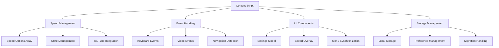

# YouTube Speed Extender - Developer Guide

This guide provides comprehensive information for developers who want to understand, modify, or contribute to the YouTube Speed Extender extension.

## 🏗️ Architecture Overview

### Extension Type
- **Content Script Extension**: Injects functionality into YouTube pages
- **Manifest V3**: Modern Chrome extension standard
- **No Background Script**: Minimal resource usage
- **No Popup**: All interaction happens on YouTube pages

### Core Components



## 📁 File Structure Analysis

### `manifest.json`
```json
{
  "manifest_version": 3,
  "name": "Extended Youtube Playback Speed Control",
  "version": "2.0",
  "description": "Enhanced speed control...",
  "content_scripts": [
    {
      "matches": ["*://www.youtube.com/*", "*://youtube.com/*"],
      "js": ["content.js"],
      "run_at": "document_idle"
    }
  ],
  "permissions": ["activeTab"],
  "icons": { ... }
}
```

**Key Points:**
- **Minimal permissions**: Only `activeTab` required
- **Content script injection**: Runs on all YouTube pages
- **Document idle**: Waits for page to be fully loaded
- **Icon support**: 16px, 48px, 128px variants

### `content.js` Structure
```javascript
// 1. Configuration & Constants
const speedOptions = [0.5, 1, 1.5, 2, 2.5, 3, 3.5, 4, 4.5, 5];
const STORAGE_KEYS = { ... };
const NAVIGATION_MODES = { ... };

// 2. State Management
let isUpdatingSpeed = false;
let isApplyingNavigationSpeed = false;
// ... other state variables

// 3. Storage Functions
function savePreferredSpeed(speed) { ... }
function loadPreferredSpeed() { ... }
// ... other storage functions

// 4. Core Speed Management
function applyPreferredSpeed(isNavigation) { ... }
function getNavigationSpeed() { ... }
// ... other speed functions

// 5. Event Handlers
document.addEventListener('keydown', (e) => { ... });
function setupSpeedSynchronization() { ... }

// 6. UI Components
function showCustomOverlay(rate) { ... }
function showSpeedSettingsModal() { ... }

// 7. YouTube Integration
function updateYouTubeSpeedSetting(playbackRate) { ... }
function enhanceSpeedMenu(speedMenu) { ... }

// 8. Initialization
function initializeExtension(isNavigation) { ... }
// Auto-initialization code
```

## 🔧 Technical Deep Dive

### Speed Management System

#### Speed Options Array
```javascript
const speedOptions = [0.5, 1, 1.5, 2, 2.5, 3, 3.5, 4, 4.5, 5];
```
- **Fixed array**: Ensures consistent speed stepping
- **Includes YouTube's native speeds**: 0.5x, 1x, 1.5x, 2x
- **Extended range**: Up to 5x for power users
- **0.5x increments**: Provides fine-grained control

#### State Management Pattern
```javascript
let isUpdatingSpeed = false;

function applySpeed(speed) {
  if (isUpdatingSpeed) return; // Prevent recursion
  
  isUpdatingSpeed = true;
  try {
    video.playbackRate = speed;
    updateUI(speed);
  } finally {
    isUpdatingSpeed = false;
  }
}
```

**Benefits:**
- **Prevents infinite loops** when YouTube's events trigger our handlers
- **Ensures atomic operations** during speed changes
- **Provides clean error handling** with guaranteed cleanup

### Event System Architecture

#### Event Flow Diagram
```
User Input → Keyboard Handler → Speed Calculation → Video Update → UI Sync
     ↓              ↓                ↓               ↓           ↓
Navigation → URL Detection → Speed Determination → Application → Storage
     ↓              ↓                ↓               ↓           ↓
Video Events → Rate Change → Sync Check → Menu Update → State Update
```

#### Key Event Types

**1. Keyboard Events**
```javascript
document.addEventListener('keydown', (e) => {
  // Input field detection
  if (e.target.tagName.toLowerCase() === 'input' || 
      e.target.tagName.toLowerCase() === 'textarea' ||
      e.target.isContentEditable) return;
  
  // Key mapping
  const increaseKey = loadIncreaseSpeedKey();
  const decreaseKey = loadDecreaseSpeedKey();
  
  // Speed calculation and application
  // ...
});
```

**2. Video Events**
```javascript
video.addEventListener('ratechange', () => {
  // Deduplication logic
  const currentTime = Date.now();
  if (currentTime - lastRateChangeTime < 100) return;
  
  // Synchronization and storage
  // ...
});

video.addEventListener('seeking', () => {
  isSeeking = true;
});

video.addEventListener('seeked', () => {
  isSeeking = false;
  // Reapply preferred speed if needed
});
```

**3. Navigation Events**
```javascript
const autoApplyObserver = new MutationObserver(() => {
  if (location.href !== currentUrl) {
    currentUrl = location.href;
    isNavigating = true;
    isExtensionInitialized = false;
    
    setTimeout(() => {
      waitForVideoAndFullyInitialize(true);
    }, 500);
  }
});
```

### Storage System Design

#### Storage Keys Schema
```javascript
const STORAGE_KEYS = {
  PREFERRED_SPEED: 'youtube-speed-extender-preferred-speed',
  KEYBOARD_SPEED: 'youtube-speed-extender-keyboard-speed',
  NAVIGATION_MODE: 'youtube-speed-extender-navigation-mode',
  CUSTOM_NAVIGATION_SPEED: 'youtube-speed-extender-custom-navigation-speed',
  INCREASE_KEY: 'youtube-speed-extender-increase-key',
  DECREASE_KEY: 'youtube-speed-extender-decrease-key'
};
```

#### Storage Pattern
```javascript
function saveValue(key, value) {
  try {
    localStorage.setItem(key, value.toString());
  } catch (error) {
    // Silent failure - extension continues working
    // but preferences won't persist
  }
}

function loadValue(key, defaultValue) {
  try {
    const saved = localStorage.getItem(key);
    return saved ? parseFloat(saved) : defaultValue;
  } catch (error) {
    return defaultValue;
  }
}
```

**Design Principles:**
- **Graceful degradation**: Works even if storage fails
- **Type safety**: Explicit parsing and validation
- **Default values**: Always provide sensible fallbacks

### UI Component System

#### Settings Modal Architecture
```javascript
function showSpeedSettingsModal() {
  // 1. Create modal structure
  const modalOverlay = document.createElement('div');
  const modalContent = document.createElement('div');
  
  // 2. Apply YouTube-consistent styling
  modalContent.style.cssText = `
    background: #1f1f1f;
    color: #ffffff;
    border-radius: 12px;
    // ... YouTube-style properties
  `;
  
  // 3. Generate dynamic HTML
  modalContent.innerHTML = generateModalHTML();
  
  // 4. Set up event listeners
  setupModalEventListeners(modalOverlay);
  
  // 5. Add to DOM
  document.body.appendChild(modalOverlay);
}
```

#### Speed Overlay System
```javascript
function showCustomOverlay(rate) {
  let overlay = document.getElementById('yt-speed-ext');
  
  if (!overlay) {
    overlay = createOverlayElement();
    positionOverlay(overlay);
  }
  
  updateOverlayContent(overlay, rate);
  showWithAutoHide(overlay);
}
```

### YouTube Integration Layer

#### Menu Synchronization Strategy
```javascript
function updateYouTubeSpeedSetting(playbackRate) {
  if (isUpdatingSpeed) return; // Prevent recursion
  
  try {
    isUpdatingSpeed = true;
    
    // Update radio buttons
    updateSpeedMenuRadioButtons(playbackRate);
    
    // Update main settings display
    updateMainSettingsDisplay(playbackRate);
    
  } finally {
    isUpdatingSpeed = false;
  }
}
```

#### DOM Selection Strategy
```javascript
// Multiple selector strategies for robustness
const SELECTORS = {
  video: 'video',
  speedButtons: '.ytp-menuitem[role="menuitemradio"]',
  settingsMenu: '.ytp-settings-menu',
  playerContainer: '#movie_player, .html5-video-player'
};

function findElement(selector, context = document) {
  try {
    return context.querySelector(selector);
  } catch (error) {
    return null;
  }
}
```

## 🔄 Development Workflow

### Setting Up Development Environment

#### 1. Repository Setup
```bash
# Clone repository
git clone https://github.com/yourusername/Custom-Youtube-Playback-Speed-Control.git
cd Custom-Youtube-Playback-Speed-Control

# Create development branch
git checkout -b feature/your-feature-name
```

#### 2. Extension Loading
1. Open Chrome → `chrome://extensions/`
2. Enable "Developer mode"
3. Click "Load unpacked"
4. Select project directory
5. Note extension ID for debugging

#### 3. Development Tools Setup
```javascript
// Add debugging helpers (remove before production)
window.ytSpeedExtender = {
  getState: () => ({
    isUpdatingSpeed,
    isNavigating,
    currentSpeed: document.querySelector('video')?.playbackRate
  }),
  forceApplySpeed: (speed) => applyPreferredSpeed(),
  showModal: () => showSpeedSettingsModal()
};
```

### Debugging Techniques

#### Console Debugging
```javascript
// Add debug logging (conditional)
const DEBUG = true; // Set to false for production

function debugLog(message, data = null) {
  if (DEBUG) {
    console.log(`[YT Speed Extender] ${message}`, data);
  }
}

// Usage throughout code
debugLog('Applying speed', { speed, isNavigation });
```

#### Extension Inspection
1. **Extension popup**: Right-click extension icon → "Inspect popup"
2. **Content script**: F12 on YouTube page → Sources tab → Content scripts
3. **Background script**: chrome://extensions → "Inspect views: background page"

#### Performance Monitoring
```javascript
// Performance measurement
function measurePerformance(name, fn) {
  const start = performance.now();
  const result = fn();
  const end = performance.now();
  debugLog(`${name} took ${end - start}ms`);
  return result;
}

// Usage
measurePerformance('Speed Application', () => {
  applyPreferredSpeed();
});
```

### Testing Strategy

#### Manual Testing Checklist
```markdown
## Core Functionality
- [ ] Speed changes with keyboard shortcuts
- [ ] Settings modal opens and saves
- [ ] Speed persists across navigation
- [ ] YouTube controls sync properly

## Edge Cases
- [ ] Works with ad-blocked videos
- [ ] Handles network interruptions
- [ ] Works with YouTube Premium
- [ ] Compatible with live streams

## Browser Compatibility
- [ ] Chrome (latest)
- [ ] Chrome (previous version)
- [ ] Edge (Chromium)
- [ ] Brave Browser
```

#### Automated Testing Setup
```javascript
// Simple test framework for content scripts
class ExtensionTester {
  constructor() {
    this.tests = [];
    this.results = [];
  }
  
  test(name, testFn) {
    this.tests.push({ name, testFn });
  }
  
  async run() {
    for (const test of this.tests) {
      try {
        await test.testFn();
        this.results.push({ name: test.name, status: 'PASS' });
      } catch (error) {
        this.results.push({ name: test.name, status: 'FAIL', error });
      }
    }
    
    console.table(this.results);
  }
}

// Usage
const tester = new ExtensionTester();

tester.test('Speed application', () => {
  const video = document.querySelector('video');
  const originalSpeed = video.playbackRate;
  applyPreferredSpeed();
  assert(video.playbackRate === loadPreferredSpeed());
});
```

## 🚀 Advanced Development Topics

### Performance Optimization

#### Debouncing Pattern
```javascript
function createDebouncer(delay = 300) {
  let timeoutId;
  
  return function(fn) {
    clearTimeout(timeoutId);
    timeoutId = setTimeout(fn, delay);
  };
}

const debouncedMenuUpdate = createDebouncer(500);

// Usage
function onSpeedChange() {
  debouncedMenuUpdate(() => {
    updateYouTubeSpeedSetting(video.playbackRate);
  });
}
```

#### Memory Management
```javascript
class ExtensionManager {
  constructor() {
    this.observers = [];
    this.timeouts = [];
    this.eventListeners = [];
  }
  
  addObserver(observer) {
    this.observers.push(observer);
    return observer;
  }
  
  addTimeout(timeoutId) {
    this.timeouts.push(timeoutId);
    return timeoutId;
  }
  
  cleanup() {
    this.observers.forEach(obs => obs.disconnect());
    this.timeouts.forEach(id => clearTimeout(id));
    this.eventListeners.forEach(({ element, event, handler }) => {
      element.removeEventListener(event, handler);
    });
    
    this.observers = [];
    this.timeouts = [];
    this.eventListeners = [];
  }
}
```

### Error Handling Patterns

#### Graceful Degradation
```javascript
function safeOperation(operation, fallback = null) {
  try {
    return operation();
  } catch (error) {
    debugLog('Operation failed, using fallback', { error, fallback });
    return fallback;
  }
}

// Usage
const video = safeOperation(
  () => document.querySelector('video'),
  null
);

if (video) {
  // Proceed with video operations
} else {
  // Gracefully handle missing video
  debugLog('No video found, extension will retry later');
}
```

#### Error Recovery
```javascript
function withRetry(operation, maxRetries = 3, delay = 1000) {
  return new Promise((resolve, reject) => {
    let attempts = 0;
    
    function attempt() {
      attempts++;
      
      try {
        const result = operation();
        resolve(result);
      } catch (error) {
        if (attempts < maxRetries) {
          setTimeout(attempt, delay);
        } else {
          reject(error);
        }
      }
    }
    
    attempt();
  });
}
```

### Extension Security

#### Input Validation
```javascript
function validateSpeed(speed) {
  // Type validation
  if (typeof speed !== 'number') {
    return false;
  }
  
  // Range validation
  if (speed < 0.1 || speed > 10) {
    return false;
  }
  
  // Precision validation (avoid floating point issues)
  const rounded = Math.round(speed * 10) / 10;
  return speedOptions.includes(rounded);
}

function validateKey(key) {
  // Single character validation
  if (typeof key !== 'string' || key.length !== 1) {
    return false;
  }
  
  // Printable character validation
  return key.charCodeAt(0) >= 32 && key.charCodeAt(0) <= 126;
}
```

#### Content Security Policy Compliance
```javascript
// Avoid inline event handlers
// Bad:
element.innerHTML = '<button onclick="handleClick()">Click</button>';

// Good:
element.innerHTML = '<button id="my-button">Click</button>';
element.querySelector('#my-button').addEventListener('click', handleClick);

// Avoid eval and Function constructor
// Bad:
eval('someCode()');
new Function('return someCode()')();

// Good:
// Use direct function calls or predefined function mapping
```

## 📊 Extension Analytics

### Usage Tracking (Privacy-Respecting)
```javascript
// Local analytics without external reporting
class LocalAnalytics {
  constructor() {
    this.events = JSON.parse(localStorage.getItem('yt-speed-analytics') || '[]');
  }
  
  track(event, data = {}) {
    this.events.push({
      event,
      data,
      timestamp: Date.now()
    });
    
    // Keep only last 100 events
    this.events = this.events.slice(-100);
    
    localStorage.setItem('yt-speed-analytics', JSON.stringify(this.events));
  }
  
  getStats() {
    return {
      totalEvents: this.events.length,
      eventTypes: this.events.reduce((acc, { event }) => {
        acc[event] = (acc[event] || 0) + 1;
        return acc;
      }, {}),
      lastWeek: this.events.filter(e => 
        Date.now() - e.timestamp < 7 * 24 * 60 * 60 * 1000
      ).length
    };
  }
}

const analytics = new LocalAnalytics();

// Usage
analytics.track('speed_change', { from: 1, to: 1.5 });
analytics.track('settings_opened');
```

## 🔮 Future Development

### Planned Features

#### Speed Presets System
```javascript
// Planned architecture
class SpeedPresets {
  constructor() {
    this.presets = this.loadPresets();
  }
  
  createPreset(name, speed, description) {
    this.presets[name] = { speed, description, created: Date.now() };
    this.savePresets();
  }
  
  applyPreset(name) {
    const preset = this.presets[name];
    if (preset) {
      applySpeed(preset.speed);
      analytics.track('preset_applied', { name, speed: preset.speed });
    }
  }
}
```

#### Video-Specific Speed Memory
```javascript
// Planned architecture
class VideoSpeedMemory {
  constructor() {
    this.videoSpeeds = new Map();
  }
  
  getVideoId() {
    // Extract from URL or video element
    const url = new URL(location.href);
    return url.searchParams.get('v');
  }
  
  rememberSpeed(speed) {
    const videoId = this.getVideoId();
    if (videoId) {
      this.videoSpeeds.set(videoId, speed);
    }
  }
  
  getRememberedSpeed() {
    const videoId = this.getVideoId();
    return this.videoSpeeds.get(videoId);
  }
}
```

### Firefox Support Planning

#### Manifest V2 Version
```json
{
  "manifest_version": 2,
  "name": "Extended Youtube Playback Speed Control",
  "version": "2.0",
  "description": "Enhanced speed control for Firefox",
  
  "content_scripts": [
    {
      "matches": ["*://www.youtube.com/*"],
      "js": ["content.js"],
      "run_at": "document_idle"
    }
  ],
  
  "permissions": ["activeTab"],
  
  "web_accessible_resources": ["icons/*.png"]
}
```

## 📚 Learning Resources

### Chrome Extension Development
- [Chrome Extension Documentation](https://developer.chrome.com/docs/extensions/)
- [Manifest V3 Migration Guide](https://developer.chrome.com/docs/extensions/migrating/)
- [Content Script Best Practices](https://developer.chrome.com/docs/extensions/mv3/content_scripts/)

### YouTube API and DOM
- [YouTube Player API](https://developers.google.com/youtube/iframe_api_reference)
- [YouTube's DOM structure analysis tools](https://github.com/topics/youtube-api)
- [Video element specification](https://developer.mozilla.org/en-US/docs/Web/API/HTMLVideoElement)

### JavaScript and Web APIs
- [localStorage API](https://developer.mozilla.org/en-US/docs/Web/API/Window/localStorage)
- [MutationObserver](https://developer.mozilla.org/en-US/docs/Web/API/MutationObserver)
- [Keyboard Event handling](https://developer.mozilla.org/en-US/docs/Web/API/KeyboardEvent)

---

*Developer guide maintained by the YouTube Speed Extender development team*
*Last updated: June 25, 2025*
